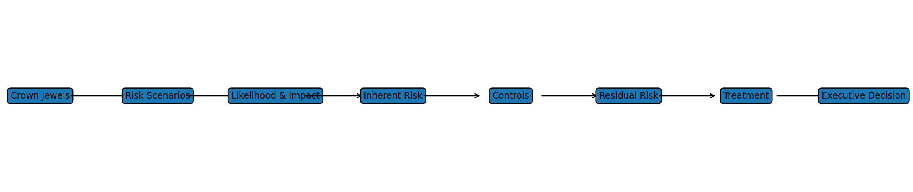

# E-Commerce Cybersecurity Risk Assessment

> GitHub portfolio case study based on a collaborative JEDEM e-commerce cybersecurity risk assessment.

## Project Goal
Show how I approach cybersecurity risk from **business asset -> threat scenario -> likelihood/impact -> inherent risk -> controls -> residual risk -> treatment -> business decision**.

## Skills Demonstrated
- Crown-jewel identification
- Risk-scenario development
- Qualitative likelihood and impact assessment
- Inherent vs. residual risk analysis
- Preventive, detective, and corrective control mapping
- Risk treatment planning
- Cost-benefit / ROI interpretation
- Executive risk communication
- Data-quality and methodology review

## Business Context
The scenario centers on an e-commerce platform handling customer and payment data, databases/APIs, intellectual property, order/logistics systems, inventory, and customer trust.

## Risks Assessed
| ID | Scenario | Likelihood | Impact | Inherent | Residual |
|---|---|---:|---:|---:|---:|
| R-01 | Data breach | Medium | High | Medium | Medium |
| R-02 | Application exploitation | Medium | High | High | Medium |
| R-03 | Misuse / non-compliance | Low | Medium | Low | Low |
| R-04 | Insider threat | Low | High | Low | Low |
| R-05 | Denial of service | Medium | Medium | High | Medium |

## Workflow

## Repository
- `docs/` - methodology, analysis, controls, treatment, CBA, executive summary, limitations, interview talking points
- `risk-register/` - cleaned XLSX and CSV risk register
- `diagrams/` - workflow and scenario-positioning visuals
- `source-materials/` - original collaborative artifacts for transparency
- `ATTRIBUTION.md` - original group attribution

## Cost-Benefit Snapshot
| Risk Area | Total Risk | Residual Risk | Risk Reduction | Control Cost | Reported ROI |
|---|---:|---:|---:|---:|---:|
| Data Breach | $350,000 | $105,000 | $245,000 | $60,000 | 308% |
| Application Exploits | $280,000 | $70,000 | $210,000 | $40,000 | 425% |
| Misuse / Non-Compliance | $20,000 | $10,000 | $10,000 | $15,000 | -33% |

## Key Takeaway
This project is intended to show that I can do more than populate a risk register: I can connect cyber risk to business value, select and categorize controls, identify residual exposure, recognize weak methodology, and communicate what management needs to decide.

## Disclaimer
Educational portfolio case study. Not a production security assessment or assurance opinion.
